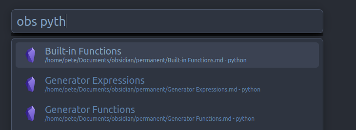
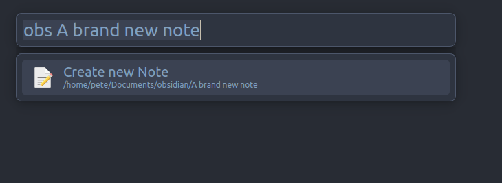

# Albert Obsidian


A fairly simple python plugin to allow [albert](https://github.com/albertlauncher/albert) to interact with an [Obsidian](https://obsidian.md/) vault.
Currently supports the following features
- Trigger query search of vault notes (default `obs`) by name/tags/body
    - Allows opening of searched note directly in obsidian
- Global query results from vault notes via name/tags/body
    - Allows opening of searched note directly in obsidian
- An indexer that re-indexes each time a note is created/moved/deleted
- Some [basic settings](#settings) to customise behaviour
- Creating a new note from query string:



Additionally, from `1.9.0` onwards, supports a FallbackQuery to allow creating a new note from a global query.

## Install

In order for this plugin to work, your Obsidian install  must be setup to [allow usage of Obsidian URI protocol](https://help.obsidian.md/Concepts/Obsidian+URI)
Run the follow from a terminal:

```shell
git clone https://github.com/Pete-Hamlin/albert-obsidian.git $HOME/.local/share/albert/python/plugins/obsidian
```

Then enable the plugin from the albert settings panel (you **must** enable the python plugin for this plugin to be loadable)

## Settings

- `root_dir`: Root directory of Obsidian vault you wish to interact with - default `None`
- `open_override`: Open action to use (see [below](#kde-open-issues)) - default `xdg-open`
- `filter_by_tags`: When searching notes, include tags on the in the search criteria - default `True`
- `filter_by_body`: When searching notes, include the text of a note in the search criteria (**WARNING**: This has potential to cause some performance issues, handle with care) - default `False`


## `kde-open` Issues

`kde-open` appears to have the behaviour of replacing `%20` encoding with raw spaces again, thereby breaking URI handling for obsidian.
This means that `xdg-open` doesn't work correctly on KDE systems, as far as I can tell.
`open_override` is therefore provided to allow a different command (confirmed that the gnome default `gio open` works as intended).

## Future Work

Potential ideas to add in future versions:
- [ ] Add a list of ignore folders for extension (mainly to blacklist `.trash` from being parsed)
- [x] FallbackQuery handler
- [ ] Vault selector via query
- [ ] Custom metadata to add to the search criteria
